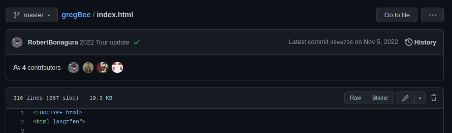

# Code Contribution Guidelines

## Addings tour dates

Look below for how to:
1. Edit the website and
2. Save your changes

### Editing the website

1. Open the `index.html` file at https://github.com/RobertBonagura/gregBee/blob/master/index.html

2. Edit the file using the pencil icon near the top of the page, pictured below:<br>


3. Scroll down to approximately line 102, you should see a series of blocks each of the following form:

```
<!--

    <div class="resume-item d-flex flex-column flex-md-row justify-content-between mb-5">
      <div class="resume-content">
        <h3 class="mb-0">Event Name</h3>
        <div class="subheading mb-3">City, State</div>
        <div>Time(hh:mm pm/am)</div>
      </div>
      <div class="resume-date text-md-right">
        <span class="text-primary">Date(Month DD, YYYY)</span>
      </div>
    </div>

  -->
```

- The first block on that page is a template. Notice that it is greyed out and surrounded by a `<!--` and a `-->`. Any html written in between these symbols is _commented out_ and will not be displayed. The 3 blocks of this form that follow are highlighted. These are the blocks responsible for displaying the tour dates. More specifically, each block corresponds to an individual tour date item in the list of tour dates at www.gregbeepoetry.com.

4. Keep the template block, the one that appears as greyed out in the editor and is shown above, exactly as is. This can be referenced to create any relevant dates that you want to add.

- To add or remove a tour date, copy and paste the above template where you want it, remove the `<!--` and a `-->` from around it and fill in the appropriate fields. Don't delete the template so that it is always there when you want to add a new date.

- Another note about HTML, spaces and indentation don't really matter. Keeping consistent spacing makes it more readable but it will not break the code if the indentation is formatted differently.

### Saving your changes

1. After editing the file, scroll down to the bottom of the page to the 'Commit chages' section.

2. Name the _commit_ (this is the term we use to name each incremental change to a code base.)
The default commit name should be something like 'Create index.html'. Replace this with a concise descriptive change such as 'Updating tour dates'.
Don't bother adding an optional extended description.

3. Select _Create a new branch for this commit and start a pull request_, you can use the default branch name.
and select _Propose changes_.

4. On the next screen click _Create pull request_

5. Let me know once you have created a pull request and I will review it and Merge the pull request myself.

## Pushing changes to AWS

After committing code to master:

1. Update S3 bucket
   `aws s3 sync . s3://greg-bee`

2. Invalidate CloudFront distribution cache
   `aws cloudfront create-invalidation --distribution-id E3I4O017FOVHVQ --paths "/*"`
